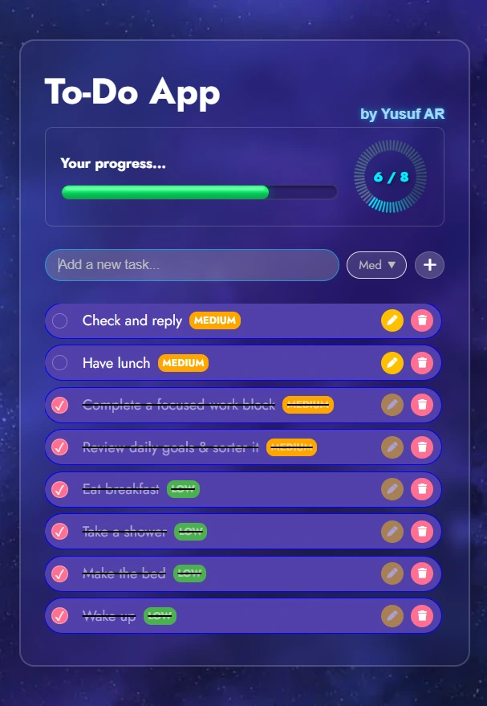
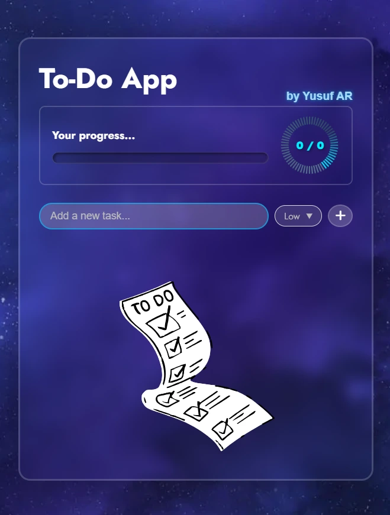
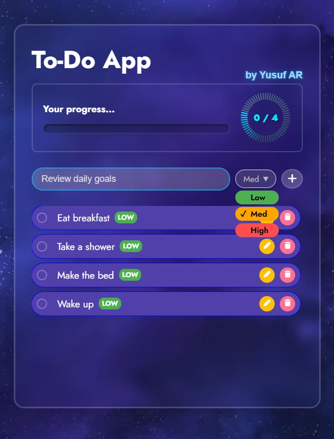
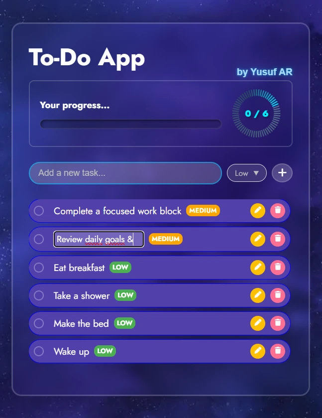

# To-Do App

[](https://github.com/Yusuf-98/Todo-List-by-Yusuf-AR/actions/workflows/ci.yml)

A fast, no-framework task manager built with vanilla JavaScript — no build step, just open and run. Add tasks, set priorities, track progress, and pick up right where you left off — everything you add is saved locally in your browser.

🚀 **Live demo:** https://todo-list-by-yusuf-ar.vercel.app/

<p align="center">
  
</p>


## Features

- Add, edit, and delete tasks
- Priority levels (Low / Medium / High) with color-coded tags
- Progress tracker (completed / total) with an animated ring and progress bar
- Tasks persist across page reloads via `localStorage`
- Loads its initial task list from a custom REST API ([todoList-API](https://github.com/Yusuf-98/todoList-API), served through [my-json-server](https://my-json-server.typicode.com/))

## Screenshots

| Empty state | Adding a task | Editing a task |
| --- | --- | --- |
|  |  |  |

## Tech stack

- JavaScript (ES6+ Classes, Async/Await)
- DOM manipulation
- Fetch API for the initial data load
- LocalStorage for persistence

## Getting started

This is a static site — no build step required.

```bash
git clone https://github.com/Yusuf-98/Todo-List-by-Yusuf-AR.git
cd Todo-List-by-Yusuf-AR
```

Then simply open `index.html` in your browser, or serve the folder with any static server (e.g. the VS Code "Live Server" extension).

To run the linter locally:

```bash
npm install
npm run lint
```

## Performance

- The background image is served as WebP, compressed from a 944 KB JPEG to about 103 KB with no visible quality loss.
- Screenshots in this README are compressed WebP, around 40–50 KB each.
- No framework or bundler — the whole app is one small HTML, CSS and JS file each, with no build output to ship.

## API

The app talks to a small seed API ([todoList-API](https://github.com/Yusuf-98/todoList-API), served through [my-json-server](https://my-json-server.typicode.com/)):

- `GET /todos` — fetched once, only when `localStorage` is empty, to populate the initial task list. After that, all changes are read from and written to `localStorage` directly.

## Project structure

```
├── index.html
├── script.js
├── style.css
└── assets/
    ├── background-image.webp
    ├── screenshot-*.webp
    └── og-image.jpg
```

## Deployment

Deployed on Vercel as a static site — no build configuration needed.

## Author

Built by [Yusuf AR](https://github.com/Yusuf-98).

## License

Licensed under the [MIT License](LICENSE).
