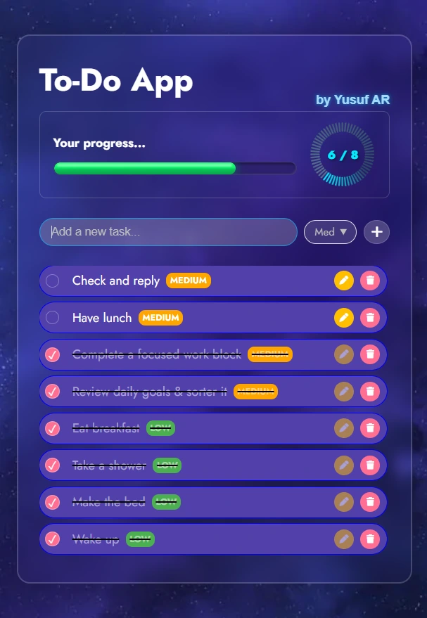
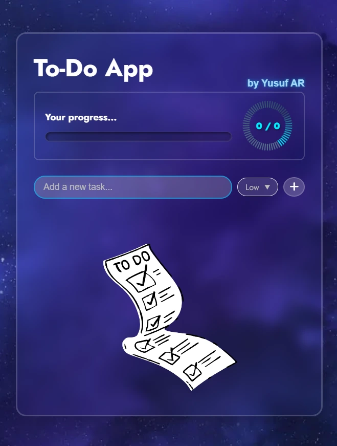
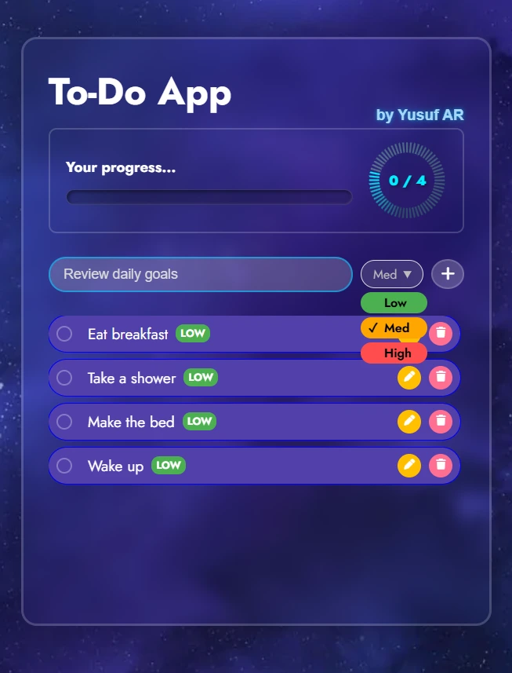
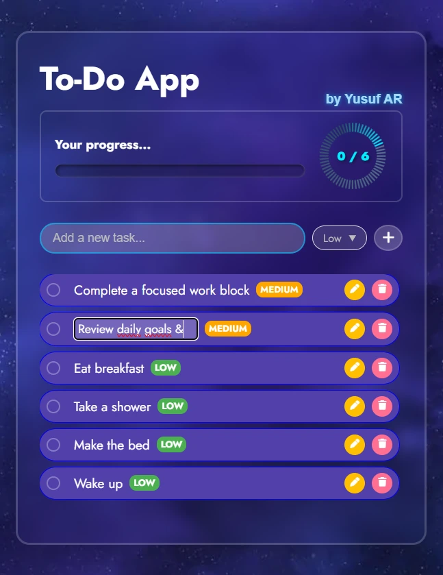

# To-Do App

[](https://github.com/Yusuf-98/Todo-List-by-Yusuf-AR/actions/workflows/ci.yml)

A fast, no-framework task manager built with vanilla JavaScript — no build step, just open and run. Add tasks, set priorities, track progress, and pick up right where you left off — everything you add is saved locally in your browser.

🚀 **Live demo:** https://todo-list-by-yusuf-ar.vercel.app/

<p align="center">
  
</p>

[](#performance)


## Features

- Add, edit, and delete tasks
- Priority levels (Low / Medium / High) with color-coded tags
- Progress tracker (completed / total) with an animated ring and progress bar
- Tasks persist across page reloads via `localStorage`
- Loads its initial task list from a JSON seed file with the Fetch API

## Screenshots

| Empty state | Adding a task | Editing a task |
| --- | --- | --- |
|  |  |  |

## Tech stack

- JavaScript (ES6+ Classes, Async/Await)
- DOM manipulation
- Fetch API for the initial data load
- LocalStorage for persistence

## Getting started

This is a static site — no build step required.

```bash
git clone https://github.com/Yusuf-98/Todo-List-by-Yusuf-AR.git
cd Todo-List-by-Yusuf-AR
```

Then simply open `index.html` in your browser, or serve the folder with any static server (e.g. the VS Code "Live Server" extension).

To run the linter locally:

```bash
npm install
npm run lint
```

## Performance

Lighthouse results for the [live site](https://todo-list-by-yusuf-ar.vercel.app/): the median of 10 mobile and 6 desktop runs on 30 September 2026 (Lighthouse 13.5.0).

| | 📱 Mobile | 🖥️ Desktop |
| --- | :---: | :---: |
| **Performance** | **93** | **99** |
| **Accessibility** | **100** | **100** |
| **Best practices** | **100** | **100** |
| **SEO** | **100** | **100** |

Mobile performance ranged from 90 to 99 across the 10 runs; desktop ranged from 98 to 100 across the 6 runs.

### Core metrics

| Metric | 📱 Mobile | 🖥️ Desktop | Good if |
| --- | :---: | :---: | :---: |
| **First Contentful Paint** (first pixels) | 🔴 2.5 s | 🟢 0.8 s | ≤ 1.8 s |
| **Largest Contentful Paint** (main content visible) | 🔴 2.5 s | 🟢 0.8 s | ≤ 2.5 s |
| **Total Blocking Time** (page unresponsive) | 🟢 0 ms | 🟢 0 ms | ≤ 200 ms |
| **Cumulative Layout Shift** (content jumping) | 🟢 0.057 | 🟢 0.035 | ≤ 0.1 |
| **Speed Index** (how fast it fills in) | 🟢 2.5 s | 🟢 0.8 s | ≤ 3.4 s |
| **Page weight** (compressed) | 115 KiB | 115 KiB | |

🟢 within Google's "good" range · figures are medians

### What "mobile" means in this test

The mobile test does not simply run on a fast laptop. Lighthouse slows the machine down to imitate a mid-range phone on a weak connection:

- **Device**: a Moto G Power (2022), 412 × 823 px screen at 1.75× pixel density.
- **Network**: simulated slow 4G, about **1.6 Mbps** download with **150 ms** of round-trip latency.
- **CPU**: slowed down **4×**, so JavaScript takes four times as long to run as it does on the laptop.

The desktop test uses a 1350 × 940 px screen, 10 Mbps, 40 ms latency and no CPU slowdown.

Run it yourself with [PageSpeed Insights](https://pagespeed.web.dev/analysis?url=https%3A%2F%2Ftodo-list-by-yusuf-ar.vercel.app%2F&form_factor=mobile) or `npx lighthouse https://todo-list-by-yusuf-ar.vercel.app/ --form-factor=mobile`. A single run can move by a few points with network conditions, which is why the figures above are medians.

### How it stays fast

- **Icons** are inline SVG matched to Font Awesome's exact paths, instead of loading Font Awesome's CSS and font file from a CDN for 3 glyphs.
- **Background image** is served as WebP, compressed from a 944 KB JPEG to about 82 KB, with a 29 KB variant for screens narrower than 768 px.
- **Empty-state illustration** is compressed 75% with SVGO (73 KB → 18 KB), has explicit `width`/`height` to avoid layout shift, and is `loading="lazy"` with `display: none` by default — so it isn't fetched at all on the common path where the list already has tasks.
- **Jost** is self-hosted as a single variable latin `woff2` (26 KB, weights 100–900) with `font-display: swap`, so text renders immediately and no request goes to a third-party font host. `style.css` carries `fetchpriority="high"`.
- **`script.js`** loads with `defer` so it never blocks the initial paint.
- **The progress ring's tick animation** animates `opacity` (GPU-composited) instead of `background-color`, cutting continuous repaint work from ~41 ms to ~1 ms per 5 seconds while the tab is open.
- **Seed data** is a static `db.json` served from the same origin, so every request on first load goes to one domain.

## API

The initial task list comes from [`db.json`](db.json), deployed alongside the app:

- `GET /db.json` — fetched once, only when `localStorage` is empty, to populate the initial task list from its `todos` array. After that, all changes are read from and written to `localStorage` directly.

## Project structure

```
├── index.html
├── script.js
├── style.css
├── db.json
└── assets/
    ├── fonts/jost-latin.woff2
    ├── background-image.webp
    ├── background-image-mobile.webp
    ├── screenshot-*.webp
    └── og-image.jpg
```

## Deployment

Deployed on Vercel as a static site — no build configuration needed.

## Author

Built by [Yusuf AR](https://github.com/Yusuf-98).

## License

Licensed under the [MIT License](LICENSE).
